# Hubbles Constant and Age of The Universe
Rahul Kenneth Fernandes
02/13/2025


## Objectives:

1.  Read in the data from the object, which is saved as galaxies.RData.
2.  Perform EDA of the data.
3.  Fit a linear no-intercept model (called Hubble’s Law).
4.  Assess the quality of the model fit.
5.  Estimate Hubble’s constant, including units.
6.  Approximate the age of the universe.

## Setting Up the Environment


``` r
library(tidyverse)
```

## Load Data


``` r
load("./galaxies.RData")
```

## Exploratory Data Analysis

### Dataset


```
##     Galaxy velocity distance
## 1  NGC0300      133     2.00
## 2  NGC0925      664     9.16
## 3 NGC1326A     1794    16.14
## 4  NGC1365     1594    17.95
## 5  NGC1425     1473    21.88
## 6  NGC2403      278     3.22
```

```
## Rows: 24
## Columns: 3
## $ Galaxy   <fct> NGC0300, NGC0925, NGC1326A, NGC1365, NGC1425, NGC2403, NGC2541, NGC20…
## $ velocity <int> 133, 664, 1794, 1594, 1473, 278, 714, 882, 80, 772, 642, 768, 609, 14…
## $ distance <dbl> 2.00, 9.16, 16.14, 17.95, 21.88, 3.22, 11.22, 11.75, 3.63, 13.80, 10.…
```

The dataset contains three columns: Galaxy, velocity and distance. Where, the Galaxy columns contains the catalog names of galaxies, the velocity column contains the velocity at which the respective galaxy is moving and the distance column contains the distance of the respective galaxy from Earth. The velocity is measured in km/s and the distance is measured in Mpc or megaparsec, where 1Mpc = 3.086e19 km.

### Summary Statistics


```
##       Galaxy      velocity         distance    
##  IC4182  : 1   Min.   :  80.0   Min.   : 2.00  
##  NGC0300 : 1   1st Qu.: 616.5   1st Qu.: 8.53  
##  NGC0925 : 1   Median : 827.0   Median :13.08  
##  NGC1326A: 1   Mean   : 924.4   Mean   :12.05  
##  NGC1365 : 1   3rd Qu.:1423.2   3rd Qu.:15.87  
##  NGC1425 : 1   Max.   :1794.0   Max.   :21.98  
##  (Other) :18
```


### Univariate Analysis
In this part, we look at velocity and distance individually.

Range of Velocity:

```
## [1] "Min:  80 ; Max:  1794"
```

Variance and Standard Deviation of Velocity:

```
## [1] "Variance: 262978.157608696"
```

```
## [1] "Standard Deviation: 512.813960036869"
```
IQR of Velocity:

```
## [1] "IQR of velocity: 806.75"
```

Outliers in velocity (using 1.5 * IQR):

```
## integer(0)
```

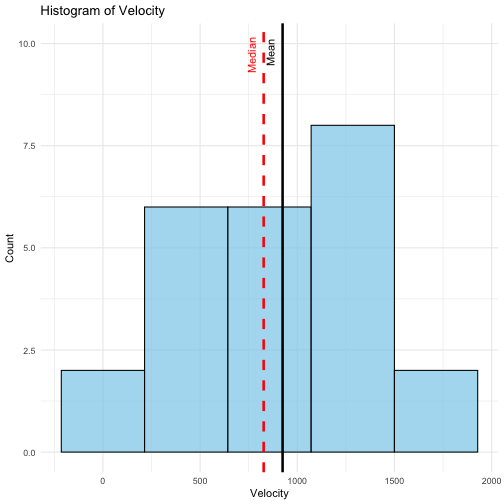

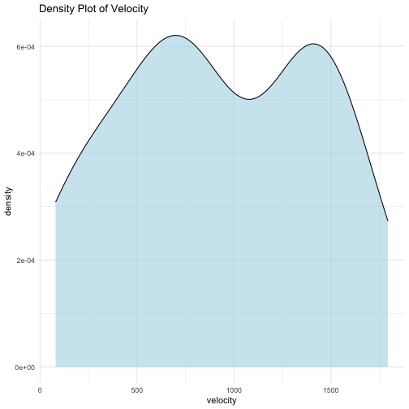

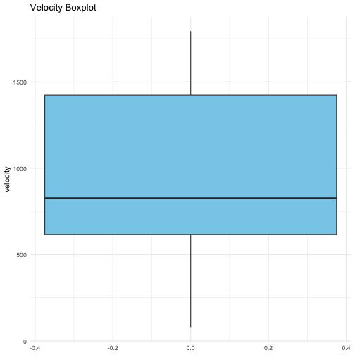

Velocity: The median velocity (827.0 km/s) is lesser than the mean velocity (924.4 km/s), hence indicating a right skew in the data. This can be observed in the histogram of velocity. This can also be observed in the box plot, where the median line is not at the center of the box plot. The box plot also shows no outliers. Considering the minimum velocity (80.0 km/s), maximum velocity (1794.0 km/s), the IQR (806.75 km/s) and the density plot, we can observe that the data is not closely packed near the center and has a wide spread. We can also see this when we calculate the Standard Deviation of the velocity data (512.814 km/s). Hence, there is a deviation from the normal expected bell curve of a normal distribution.


Range of Distance:

```
## [1] "Min:  2 ; Max:  21.98"
```
Variance and Standard Deviation of Distance:

```
## [1] "Variance: 33.8101389492754"
```

```
## [1] "Standard Deviation: 5.81464865226398"
```
IQR of Distance:

```
## [1] "IQR of distance: 7.34"
```

Outliers in distance (using 1.5 * IQR):

```
## numeric(0)
```

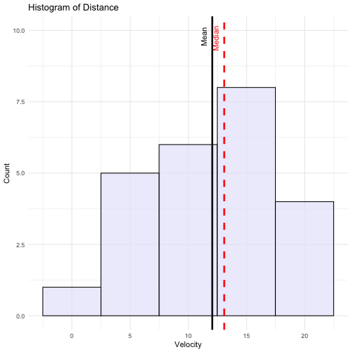

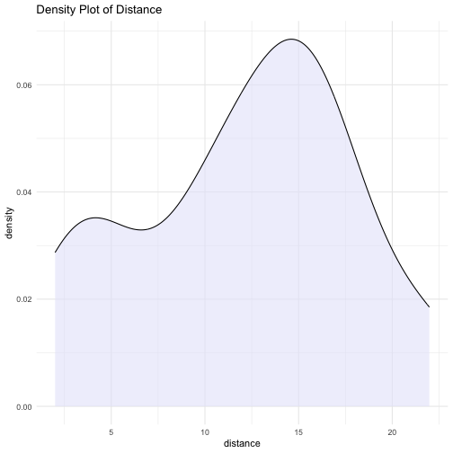

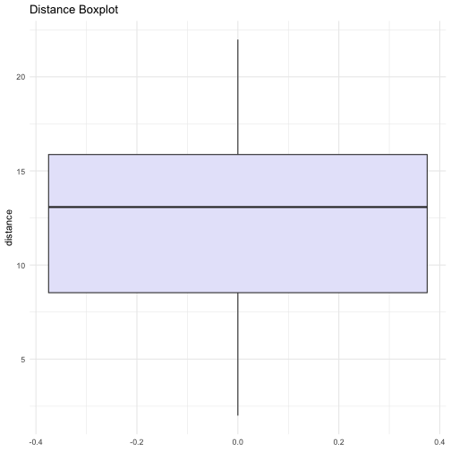

Distance: the median distance (13.08 Mpc) is greater than the mean distance (12.05 Mpc), hence indicating a left skew in the data. This can be observed in the histogram of distances. This can also be observed in the box plot, where the median line is not at the center of the box plot. The box plot also shows no outliers. Considering the minimum distance (2.00 Mpc), maximum distance (21.98 Mpc), the IQR (7.34 Mpc) and the density plot, we can observe that the data is closely packed near the center and has a wide spread. We can also see this when we calculate the Standard Deviation of the distances (5.814649 Mpc). Hence, there is a deviation from the normal expected bell curve of a normal distribution.


### Bivariate Analysis
Correlation matrix:

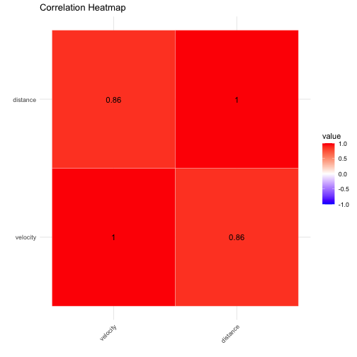

Pearson Correlation Test:

```
## 
## 	Pearson's product-moment correlation
## 
## data:  distance and velocity
## t = 8.0189, df = 22, p-value = 5.677e-08
## alternative hypothesis: true correlation is not equal to 0
## 95 percent confidence interval:
##  0.7054127 0.9394555
## sample estimates:
##       cor 
## 0.8631815
```

Linear Relationship:


```
## `geom_smooth()` using formula = 'y ~ x'
```

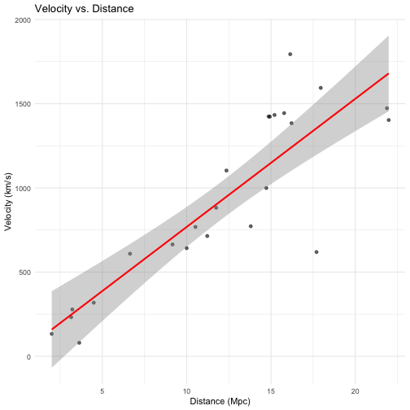
The correlation matrix heat map and the Pearson Correlation test show us that there is high correlation between velocity and distance with a Pearson's Coefficient of 0.86. The linear relationship is confirmed by the scatter plot of velocity and distance with a regression line plotted through it. From this information, we can proceed to fit a linear model.

## Fitting a No-Intercept Model
No-Intercept Linear Model (also called as Hubble's Law):

``` r
model <- lm(velocity ~ distance + 0, data = galaxies)
```

Model Summary:

```
## 
## Call:
## lm(formula = velocity ~ distance + 0, data = galaxies)
## 
## Residuals:
##    Min     1Q Median     3Q    Max 
## -736.5 -132.5  -19.0  172.2  558.0 
## 
## Coefficients:
##          Estimate Std. Error t value Pr(>|t|)    
## distance   76.581      3.965   19.32 1.03e-15 ***
## ---
## Signif. codes:  0 '***' 0.001 '**' 0.01 '*' 0.05 '.' 0.1 ' ' 1
## 
## Residual standard error: 258.9 on 23 degrees of freedom
## Multiple R-squared:  0.9419,	Adjusted R-squared:  0.9394 
## F-statistic: 373.1 on 1 and 23 DF,  p-value: 1.032e-15
```

Plotting the Linear Model:

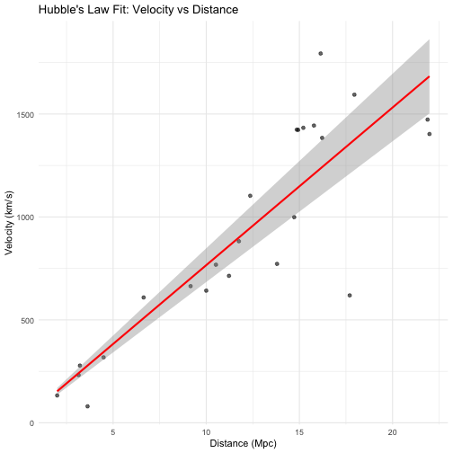

## Assessing the quality of the model fit
Residuals vs. fitted values plot:

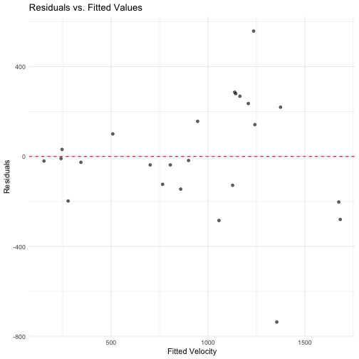
From Residuals vs. fitted values plot, we can see that the points are randomly distributed around 0 without any pattern. This shows that the linear model holds good and the relationship between velocity and distance is linear.

Residual distribution:

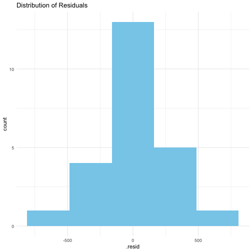

Q-Q plot for normality:

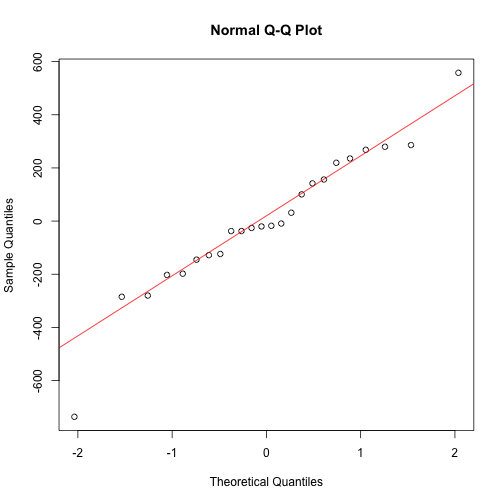
In the Q-Q plot, majority of the points fall near the red line, indicating that the residuals are approximately normal.The points at the left and right tail, deviate from the red line which indicates the presence of heavy tails in the distributions. This can also be observed from the residual histogram which follows an approximate bell shaped curve.  

Model fit quality:

```
## [1] "RSE (in km/s): 258.933064035632"
```

```
## [1] "RMSE (in km/s)) 253.481231058161"
```

```
## [1] "R-squared:  0.941931023545281"
```
The RSE (258.93) and RSME (253.48) are close to each other, which suggests homoscedasticity, i.e, residuals have constant variance. The model typical prediction error is around 253-259 km/s. A high R-squared (0.9419) shows that the model fits the data very well.

Distance Coefficient Significance:

```
##     Estimate   Std. Error     Pr(>|t|) 
## 7.658117e+01 3.964794e+00 1.031907e-15
```
The Estimate of the coefficient is calculated as 76.58. The standard error is small, indicating a more precise estimation. Since p < 0.05, "distance" is a statistically significant predictor. The near-zero p value shows that distance has a meaningful effect on velocity.

## Calculating Hubble's Constant
We can calculate Hubble's Constant by calculating the distance coefficient from the no-intercept linear model. 


``` r
hubble_constant <- coef(model)["distance"]
print(paste("Hubble Constant (H_0):", round(hubble_constant, 2), "km/s/Mpc"))
```

```
## [1] "Hubble Constant (H_0): 76.58 km/s/Mpc"
```

## Approximating the Age of the Universe

``` r
# Constants
mpc_to_km <- 3.086e19   # 1 Mpc = 3.086e19 km
seconds_per_year <- 3.154e7

# Calculate age in seconds
age_seconds <- (1 / hubble_constant) * mpc_to_km

# Convert to years
age_years <- age_seconds / seconds_per_year

# Print results
print(paste("Age of the Universe (approx):", 
            round(age_years / 1e9, 2), "billion years"))
```

```
## [1] "Age of the Universe (approx): 12.78 billion years"
```

